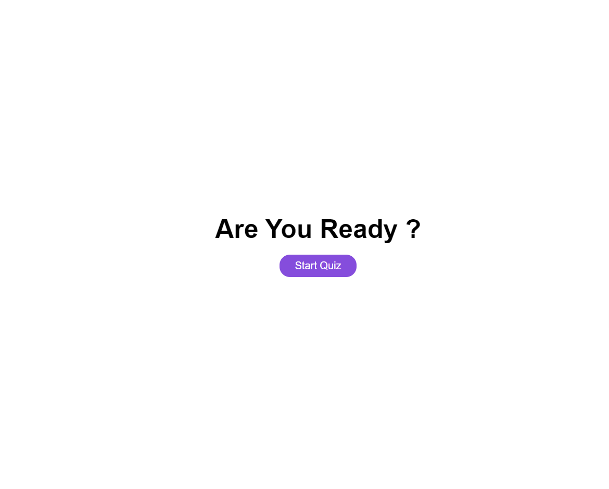
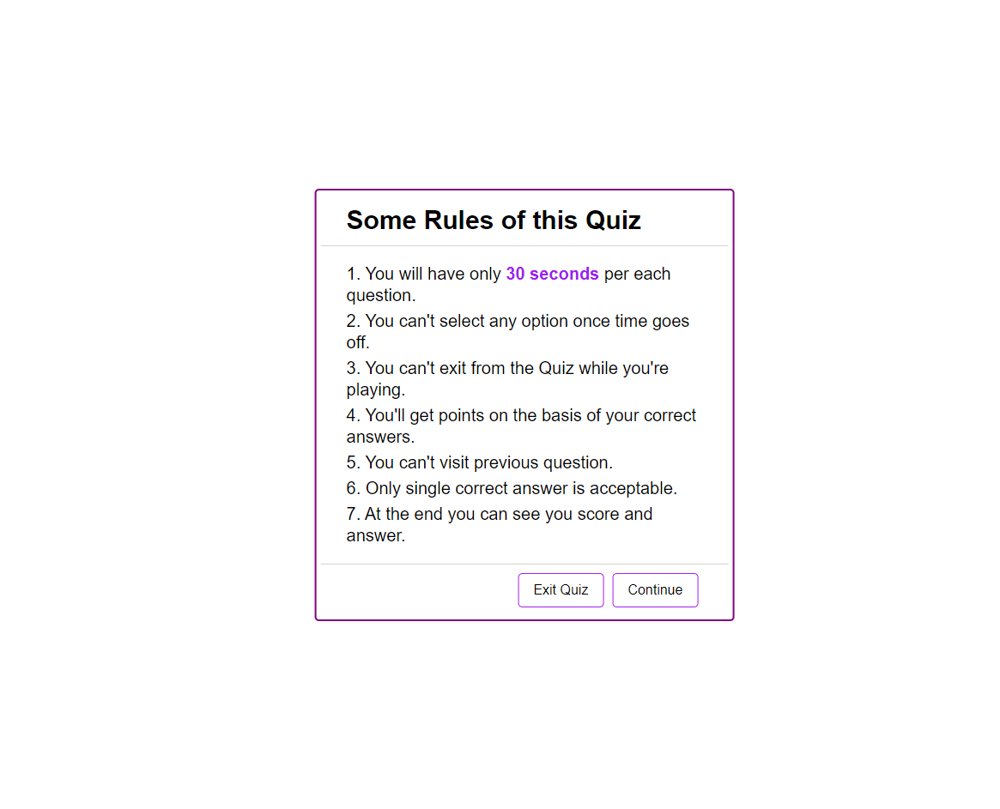
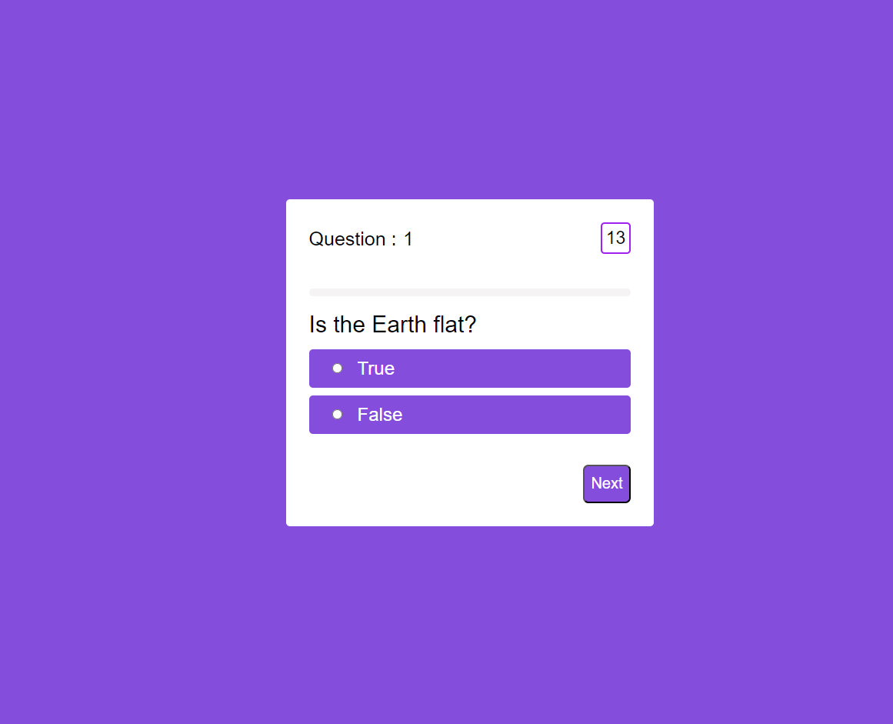
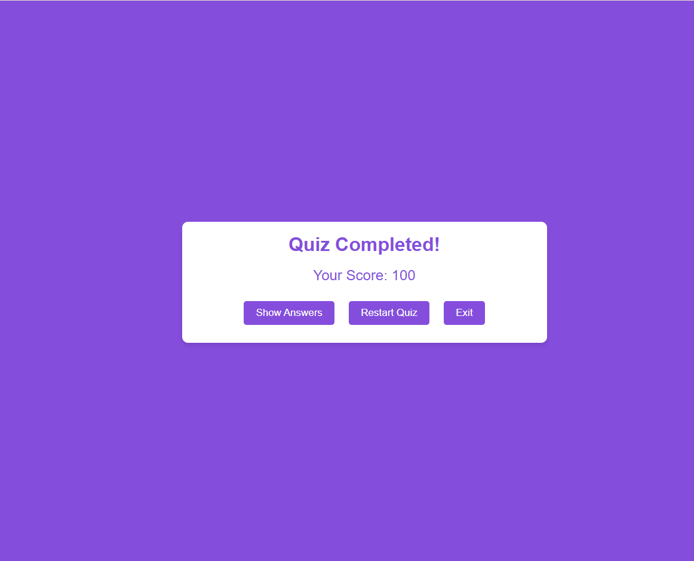

# Quiz App

Welcome to the Quiz App! This application allows you to test your knowledge through a series of timed questions. Below are the instructions on how to use the app.

## Instructions

### 1. Starting the Quiz
- When you open the app, you will be greeted with a home page that has a "Start Quiz" button.
- Click on the "Start Quiz" button to begin.

### 2. Instructions Box
- After clicking the "Start Quiz" button, an instruction box will pop up with the rules of the quiz.
- You have two options:
  - **Exit Quiz:** Click this button to go back to the home page.
  - **Continue:** Click this button to proceed to the quiz.

### 3. Question Page
- Each question page will display a question with multiple-choice options.
- You will have 30 seconds to answer each question.
  - If you do not select an option within 30 seconds, the quiz will automatically move to the next question.
  - If you select an option before the time runs out, the quiz will move to the next question immediately.
- You cannot revisit previous questions.

### 4. Score Page
- After you have attempted all the questions, you will be taken to the score page.
- On the score page, you can:
  - **View your score:** See the total points you scored based on your correct answers.
  - **Get Answer Details:** Review the correct answers for each question.
  - **Restart the Quiz:** Click this button to restart the quiz from the beginning.
  - **Exit:** Click this button to exit the quiz and return to the home page.

## Features
- **Timed Questions:** Each question is timed to ensure a quick and engaging experience.
- **Automatic Progression:** The quiz automatically moves to the next question if time runs out.
- **Score Tracking:** Your score is calculated based on the number of correct answers.
- **Answer Review:** You can review the correct answers after completing the quiz.

## Technologies Used
- HTML
- CSS 
- JavaScript
